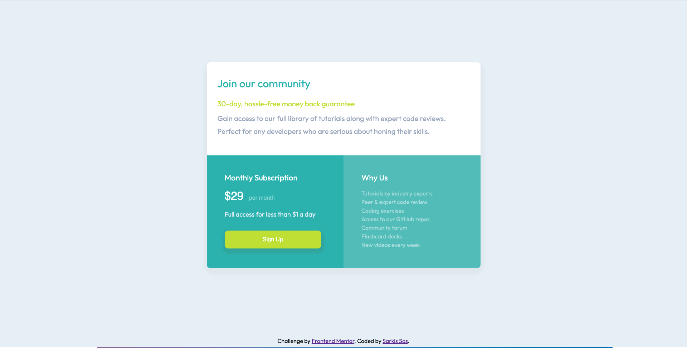

# Frontend Mentor - Single price grid component solution

This is a solution to the [Single price grid component challenge on Frontend Mentor](https://www.frontendmentor.io/challenges/single-price-grid-component-5ce41129d0ff452fec5abbbc). Frontend Mentor challenges help you improve your coding skills by building realistic projects.

## Table of contents

- [Overview](#overview)
  - [The challenge](#the-challenge)
  - [Screenshot](#screenshot)
  - [Links](#links)
- [My process](#my-process)
  - [Built with](#built-with)
  - [What I learned](#what-i-learned)
  - [Useful resources](#useful-resources)
- [Author](#author)

## Overview

### The challenge

Users should be able to:

- View the optimal layout for the component depending on their device's screen size
- See a hover state on desktop for the Sign Up call-to-action

### Screenshot

### Links

- Solution URL: [Github](https://github.com/Sarkis-S/single-price-grid-component)
- Live Site URL: [Netlify](https://curious-marigold-dcaf56.netlify.app)

## My process
- Figure out the structure of the component (thinking in boxes)
  * I decided to use CSS Grid this time just to try and learn something new
- Given a style guide determine how I can make best use of them
  * I decided to use SCSS/SASS so that I can take advante of reusable varable styles
- Center main element to the middle of the desktop
- Apply the styling for mobile view
- Apply the styling for desktop view
- Apply the hover effect
- Apply font from Google fonts
- Editing and many more touch ups
- Complete README
- Host component live

### Built with

- Semantic HTML5 markup
- CSS custom properties
- Flexbox
- CSS Grid
- Mobile-first workflow

### What I learned

Although this was a simple component I was pleasantly surprised how much work I had put into it. It's a super fun project as I spent much time being extremely meticulous about the fine details, which required plenty of CSS work. If I learned anything in this challenge it would definitely be the understanding of how CSS puts everything together. I've also learned how CSS Grid can be a powerful tool in controlling the layout of the page. I may just use it more often in the future.

### Useful resources

- [CSS Grid Tips & Tricks](https://css-tricks.com/snippets/css/complete-guide-grid/) - I taught myself CSS Grid following this link.
- [SASS Basics](https://sass-lang.com/guide)
- [SASS Short Read](https://medium.com/swlh/learn-the-scss-sass-basics-in-5-minutes-73002653b443)
- [Button Hover](https://alvarotrigo.com/blog/best-css-button-hover-effects/) - Cool effects here

## Author

- Website - [Sarkis Sos](https://www.your-site.com)
- Frontend Mentor - [@Sarkis-S](https://www.frontendmentor.io/profile/Sarkis-S)
